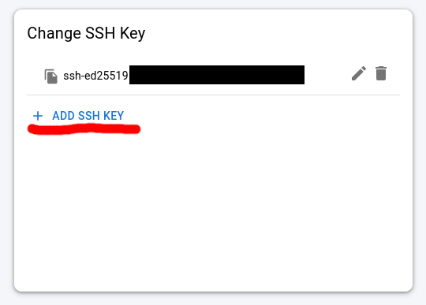
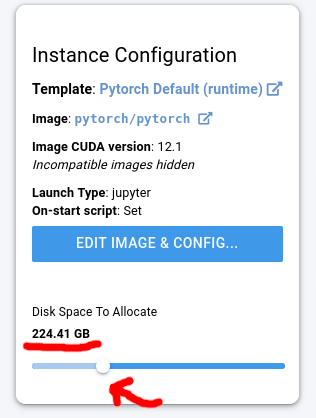
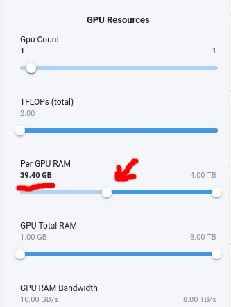
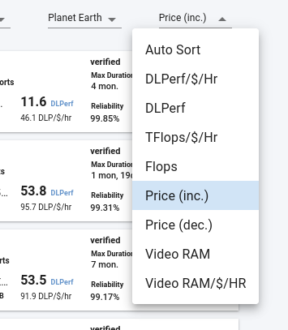
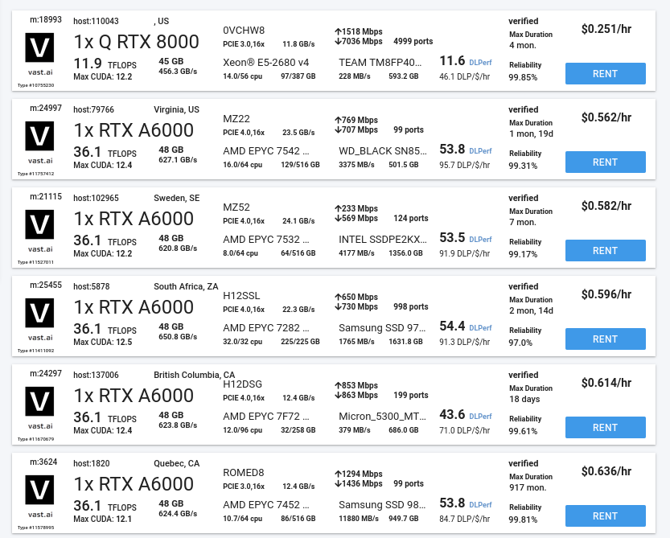
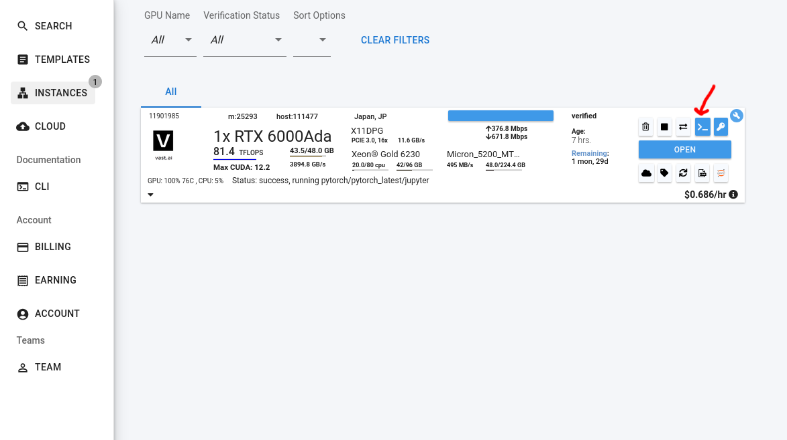
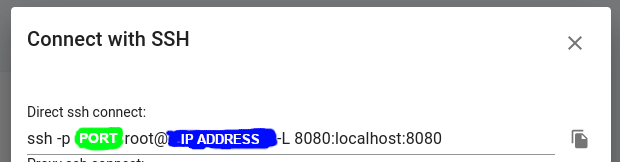

# Super Simple LoRA Training for flux-dev using vast.ai

Things you need:

- A computer with `ssh`, `scp`, and `git` installed. [Windows users see here for SSH](https://learn.microsoft.com/en-us/windows-server/administration/openssh/openssh_install_firstuse?tabs=gui) and [here for git](https://git-scm.com/download/win).
- A [wandb](https://wandb.ai/) account and API key, to watch your training progress
- A [huggingface](https://huggingface.co/docs/hub/en/security-tokens) account and API token with write access (do not use a granular token), to store your checkpoints
- To go to the [black-forest-labs/FLUX.1-dev](https://huggingface.co/black-forest-labs/FLUX.1-dev) and agree to use their model on your Huggingface account.
- At least $10 in [vast.ai](https://vast.ai/) credits.

## Step 1: Clone this repo.

Open up a terminal and run:

```sh
git clone https://github.com/AmericanPresidentJimmyCarter/simple-flux-lora-training
cd simple-flux-lora-training
mkdir dataset
```

## Step 1: Make an SSH key (optional, one time only)

Run `ssh-keygen -t ed25519` to generate an SSH key. Follow the instructions. You will need this for vast.

```bash
greys@mcfly:~ $ ssh-keygen -t ed25519
Generating public/private ed25519 key pair.
Enter file in which to save the key (/Users/greys/.ssh/id_ed25519):
Enter passphrase (empty for no passphrase):
Enter same passphrase again:
Your identification has been saved in /Users/greys/.ssh/id_ed25519.
Your public key has been saved in /Users/greys/.ssh/id_ed25519.pub.
The key fingerprint is:
SHA256:FHsTyFHNmvNpw4o7+rp+M1yqMyBF8vXSBRkZtkQ0RKY user@foo
The key's randomart image is:
+--[ED25519 256]--+
|       */Xoo     |
|  . . .===..o    |
|   + .Eo+.oo     |
|    o ..o.+.     |
|   .   .S  + .   |
|  . .     . *    |
|   . . . + o .   |
|      o O .      |
|     .*Xo=       |
+----[SHA256]-----+
```

There are two important paths that are displayed above.

- **Public key**: `/Users/greys/.ssh/id_ed25519`
- **Private key**: `/Users/greys/.ssh/id_ed25519.pub`

Next, get your SSH public key using  `cat /path/to/key.pub`. In the above example, we would run `cat /Users/greys/.ssh/id_ed25519.pub`. It will look something like:

```sh
ssh-ed25519 AAAAC3NzaC1lZDI1NTE5AAAAIK0wmN/Cr3JXqmLW7u+g9pTh+w... user@foo
```

Also note the location of your private key (here it was `/Users/greys/.ssh/id_ed25519`).

Open up your [Account page on vast](https://cloud.vast.ai/account/) and click Add SSH Key.



A box will pop up. Paste in the public key into that box and click "Add". You should now see that SSH public key listed under the "Change SSH Key" section of the Account page.

## Step 2: Dataset

I like to make a dataset that contains about 20-50 images of the subject/style and equally many regularisation images. The regularisation images should be similar to your media (e.g. photos for realism, art for art styles) but have distinctly different styles or concepts.

I have the training batch size set to 4 in `config.env`, so if you use this default be that **your total number of images is divisble by 4**.

You can also finetune on larger datasets! SimpleTuner supports whatever size dataset you might have, into the millions of images.

For finetuning flux-dev, you have the choice between between the 512x512 or 1024x1024. I prefer to finetune in 1024x1024 because it can preserve more details of the images. To keep it simple, **this guide is for finetuning in 1024x1024**. Please make sure all your images are at least one megapixel in size. I prefer to manually crop my images to square before training so that I know they are cropped correctly (by default, Simple Tuner will centre crop them).

Earlier on in the guide you made a dataset folder with `mkdir dataset`. Open this folder in your file browser (Windows users: `start .` to open the location of the `simple-flux-lora-training` folder). Inside this folder, you will want to add your images in the following way:

```
dataset/
 - 1.jpg
 - 1.txt
 - 2.png
 - 2.txt
   ...
```

That is, for every corresponding image there is also a corresponding `txt` file containing your captions.

As far as captions, I usually use the following strategy:

1. 50% long captions generated by ChatGPT/Claude and manually edited for clarity/concept.
2. 50% short captions manually created by hand.

If you want to try to force a trigger word or trigger sentence, add that somewhere in the beginning of the prompt like "An image of sksbadz..." or "In the style of sksbadz...".

However, the T5 encoder in flux is generally smart enough to decode concepts from natural language too.

## Step 3: Alter the config.env

This repo ships with a `config.env` that was copied to your PC when you `git clone`d it. I recommend editing it in notepad++ or VSCode if you are in Windows. You can see the most important settings at the top, which I have highlighted for you.

I will go over them quickly:

```sh
# By default, images will be resized so their SMALLER EDGE is 1024 pixels, maintaining aspect ratio.
# Setting this value to 768px might result in more reasonable training data sizes for SDXL.
export RESOLUTION=1024

# If you want to have the training data resized by pixel area (Megapixels) rather than edge length,
#  set this value to "area" instead of "pixel", and uncomment the next RESOLUTION declaration.
export RESOLUTION_TYPE="pixel"
#export RESOLUTION=1          # 1.0 Megapixel training sizes

# If RESOLUTION_TYPE="pixel", the minimum resolution specifies the smaller edge length, measured in pixels. Recommended: 1024.
# If RESOLUTION_TYPE="area", the minimum resolution specifies the total image area, measured in megapixels. Recommended: 1.
export MINIMUM_RESOLUTION=$RESOLUTION
```

This is where I set the resolution to be 1024.

```sh
export TRACKER_PROJECT_NAME="flux-lora-training"
export TRACKER_RUN_NAME="flux-lora-training"
```

These are your wandb project and run names. The project name is reused for your HF repo.

```sh
# How often to checkpoint. Depending on your learning rate, you may wish to change this.
# For the default settings with 10 gradient accumulations, more frequent checkpoints might be preferable at first.
export CHECKPOINTING_STEPS=200

# How frequently we will save and run a pipeline for validations.
export VALIDATION_STEPS=50
```

`CHECKPOINTING_STEPS` is how often you save and upload the LoRA to Huggingface and `VALIDATION_STEPS` is how often you run validation (make test images).

```sh
# Adjust higher or lower depending on how burnt your model becomes.
export LEARNING_RATE=1e-4 #@param {type:"number"}
```

The learning rate is how quickly your model learns. A good value for this is between 1e-4 and 5e-5. Highly learning rates make your LoRA more likely to collapse into noise unexpectedly, so be careful not to raise it too high.

```sh
# If you also supply a user prompt library or `--use_prompt_library`, this will be added to those lists.
# TODO CHANGE ME
export VALIDATION_PROMPT="a man is eating a donut"
```

This is the prompt that your test picture generates. Be sure to make it something meaningful relative to your captions.

```sh
# Caption dropout probability. Set to 0.1 for 10% of captions dropped out. Set to 0 to disable.
# You may wish to disable dropout if you want to limit your changes strictly to the prompts you show the model.
# You may wish to increase the rate of dropout if you want to more broadly adopt your changes across the model.
export CAPTION_DROPOUT_PROBABILITY=0.0
```

This is how often you run images **without** any caption while training. This is important for classifier-free guidance models, but since flux-dev is distilled we can usually turn it off. Sometimes it can make your LoRA a little more stable if you set it to 0.1, but it may increase concept bleed from your LoRA concepts.

```sh
# Adjust this for your GPU memory size. This, and resolution, are the biggest VRAM killers.
export TRAIN_BATCH_SIZE=4
```

The batch size is how many samples are run at the same time. Higher batch sizes tend to be more stable and learn faster, but are slower and take more VRAM. For the absolute fastest training, set this to be 1.

```sh
export TRAINER_EXTRA_ARGS="\
--flux_guidance_value=1.0 \
--flux_lora_target=all+ffs \
--lora_rank=32 \
--keep_vae_loaded \
--adam_weight_decay=0.1 \
--max_grad_norm=1.0 \
--lr_scheduler=constant_with_warmup \
--validation_torch_compile=false \
--lora_init_type=default"
```

Most of these settings you do not need to change -- the one that is an exception is the `lora_rank=32`, which can be 1 or any multiple of 2. **The larger the LoRA rank, the more parameters your LoRA will have and thus the more capacity for learning it will have**. Likewise, the larger it is the more unwieldy it can become to train. For a single concept you may only need a rank of 8-16. For hundreds or thousands of images, you should choose a larger LoRA rank like 64 or 128.

Note that larger ranks might require lower learning rates to train stably, so don't be surprised if the learning rate you used for rank 8 fails to transfer to rank 128.

## Step 4: Train

Now we train flux. Your first task it to make a VM with enough space on it to train flux.

Go to the [vast.ai console](https://cloud.vast.ai/). Find the "Instance Configuration" card on the center left and drag the slider for the space you need to be >200 GB, which should give you a lot of room.



Now, scroll down and look on the left side for a "GPU Resources" subheading on the filters cards. Drag the per GPU RAM to 40 GB.



Finally, scroll to the top. On the top right is the box to sort the GPUs, I recommend sorting them by price (Price inc).



Now you have lots of high GPU VRAM cards to choose from. I recommend 1x A6000 or A100. Select the "Rent" button when you decide which VM you would like to rent.



Now that you have rented a box, go to the [instances](https://cloud.vast.ai/instances/) page to view it. From here, you will want to click on the button that looks like `>_`.
 


You should now see a dialogue with the SSH command to log into your server. I have highlighted the location of the port in green and the IP address in blue. You will need these later to copy files over. Now, click the paper icon on the right side to copy the SSH command and paste it into your terminal, but DO NOT run the command.



The command should look something like: `ssh -p 12345 root@222.111.222.255 -L 8080:localhost:8080`. In order to login we still need to specify the SSH key, so in the beginning of the command add a `-i` and then the **location of the private key that you generated earlier**.

In our example above, it would look like:

`ssh -p PORT -i /Users/greys/.ssh/id_ed25519 root@IP_ADDRESS -L 8080:localhost:8080`

Be sure to fill in your `PORT` and `IP_ADDRESS` of your vast.ai VM appropriately.

**Open a new terminal window**, copy this in, and Press enter. You should now connect to the VM over SSH. You may get a warning when making the connection, just answer Yes so you can connect to the host.

After connecting to the host, you will be inside a tmux window. tmux is a windowed consoled that can allow you to have multiple tabs and window panes open at the same time. [You can read more about how to use it here](https://hamvocke.com/blog/a-quick-and-easy-guide-to-tmux/) or view a [cheatsheet](https://tmuxcheatsheet.com/) for it here.

Probably the **most important thing you need to know about tmux is that to view scrollback, you do `ctrl + b` then press the `[` key then page up/page down, and then you are done press `q`.

Now we need to get SimpleTuner cloned into this environment. Run these commands in the VM terminal:

```bash
apt -y install python3.11 python3.11-venv libgl1-mesa-glx
git clone --branch=release https://github.com/bghira/SimpleTuner.git
cd SimpleTuner
python3.11 -m venv .venv
source .venv/bin/activate
pip install -U poetry pip
poetry install --no-root
pip uninstall -y deepspeed bitsandbytes diffusers
pip install git+https://github.com/huggingface/diffusers
```

This may take a bit depending on the connection speed of the VM. We don't need `deepspeed` or `bitsandbytes` because we will be training in bfloat16 precision and they can break the validation sampling on some VMs.

**If you need the `deepspeed` or `bitsandbytes` libraries, be sure to go to the [Templates page](https://cloud.vast.ai/templates/) of vast.ai and select the `PyTorch (cuDNN Devel) pytorch:2.4.0-cuda12.4-cudnn9-devel` template, which shouldn't throw errors.**

Now SimpleTuner is all sorted out, so we need to log into wandb and Huggingface.

First run

```bash
wandb login
```

then enter your wandb API key. Next, run

```bash
huggingface-cli login
```

and then enter your token for Huggingface. When it asks you if you would like to add a Git credential, select No.

Now that we are all logged in, we just need to copy our files over. 

Doing this is pretty easy, we simply use `scp` to copy over the files. `scp` is just like `cp`, but uses a secure connection to transfer your files over the network. In **the original terminal where you cloned this repository and you made the dataset folder**, use these commands to copy over the dataset. Be sure to change `/Users/greys/.ssh/id_ed25519` to your private key location and fill in the correct **PORT** and **IP_ADDRESS**.

```bash
scp -r -P PORT -i /Users/greys/.ssh/id_ed25519 dataset root@IP_ADDRESS:/root/SimpleTuner/dataset
scp -P PORT -i /Users/greys/.ssh/id_ed25519 config.env root@IP_ADDRESS:/root/SimpleTuner/config/config.env
scp -P PORT -i /Users/greys/.ssh/id_ed25519 multidatabackend.json root@IP_ADDRESS:/root/SimpleTuner/config/multidatabackend.json
```

This will copy over all the files you need to begin training. Note that if you have thousands of images, you are better off copying over `multidatabackend_with_arb.json` by:

```bash
scp -P PORT -i /Users/greys/.ssh/id_ed25519 multidatabackend_with_arb.json root@IP_ADDRESS:/root/SimpleTuner/config/multidatabackend.json
```

The `multidatabackend_with_arb.json` will train your images both as square crops and as aspect-ratio bucketed images. The default `multidatabackend.json` will train your images as square images, which is fine for most people.

Now that everything has been copied over, we start training by **going back to the terminal with the vast.ai VM** and entering this command:

```bash
bash train.sh
```

If you are lucky, SimpleTuner will begin spewing lots into the console about the training, begin downloading the models, caching the text and image embeddings, and then begin training. This can take a bit of time.

At some point, wandb should pipe in and tell you where to view your training:

```
wandb: Currently logged in as: chadbfan. Use `wandb login --relogin` to force re
login                                                                           
wandb: wandb version 0.17.6 is available!  To upgrade, please run:              
wandb:  $ pip install wandb --upgrade                                           
wandb: Tracking run with wandb version 0.16.6                                   
wandb: Run data is saved locally in /root/SimpleTuner/wandb/run-20240812_232345-
734014fd86372809856384c0ef2f05fd                                                
wandb: Run `wandb offline` to turn off syncing.                                 
wandb: Syncing run flux-lora-training                                
wandb: ⭐️ View project at https://wandb.ai/chadbfan/flux-lora-training  
v2                                                                              
wandb: 🚀 View run at https://wandb.ai/chadbfan/flux-lora-training/runs/734014ed
86372809836384c0ef2f05fd    
```

You can follow this link to view your training in progress. There validation images and training loss (a measure of how fit your model is to the training set) are reported. If your validation images become noise and the loss spikes very high, your training has collapsed and you will need to start over at a new, lower learning rate. Your checkpoints will be automatically uploaded to your Huggingface account, where you can download and use them.

Good luck!
