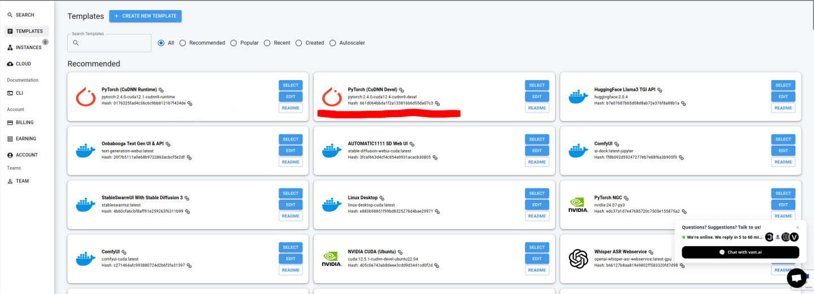

# Super Simple LoRA Training for flux-dev using vast.ai

Things you need:

- A computer with `ssh`, `scp`, and `git` installed. [Windows users see here for SSH](https://learn.microsoft.com/en-us/windows-server/administration/openssh/openssh_install_firstuse?tabs=gui) and [here for git](https://git-scm.com/download/win).
- A [wandb](https://wandb.ai/) account and API key, to watch your training progress
- A [huggingface](https://huggingface.co/docs/hub/en/security-tokens) account and API token with write access (do not use a granular token), to store your checkpoints
- To go to the [black-forest-labs/FLUX.1-dev](https://huggingface.co/black-forest-labs/FLUX.1-dev) and agree to use their model on your Huggingface account.
- At least $10 in [vast.ai](https://vast.ai/) credits.

## Step 1: Clone this repo.

Open up a terminal and run:

```sh
git clone https://github.com/AmericanPresidentJimmyCarter/simple-flux-lora-training
cd simple-flux-lora-training
mkdir dataset
```

## Step 1.1: Make an SSH key (one time only, skip if you have one)

Run `ssh-keygen -t ed25519` to generate an SSH key. Follow the instructions. You will need this for vast.

```bash
greys@mcfly:~ $ ssh-keygen -t ed25519
Generating public/private ed25519 key pair.
Enter file in which to save the key (/Users/greys/.ssh/id_ed25519):
Enter passphrase (empty for no passphrase):
Enter same passphrase again:
Your identification has been saved in /Users/greys/.ssh/id_ed25519.
Your public key has been saved in /Users/greys/.ssh/id_ed25519.pub.
The key fingerprint is:
SHA256:FHsTyFHNmvNpw4o7+rp+M1yqMyBF8vXSBRkZtkQ0RKY user@foo
The key's randomart image is:
+--[ED25519 256]--+
|       */Xoo     |
|  . . .===..o    |
|   + .Eo+.oo     |
|    o ..o.+.     |
|   .   .S  + .   |
|  . .     . *    |
|   . . . + o .   |
|      o O .      |
|     .*Xo=       |
+----[SHA256]-----+
```

There are two important paths that are displayed above.

- **Public key**: `/Users/greys/.ssh/id_ed25519`
- **Private key**: `/Users/greys/.ssh/id_ed25519.pub`

Next, get your SSH public key using  `cat /path/to/key.pub`. In the above example, we would run `cat /Users/greys/.ssh/id_ed25519.pub`. It will look something like:

```sh
ssh-ed25519 AAAAC3NzaC1lZDI1NTE5AAAAIK0wmN/Cr3JXqmLW7u+g9pTh+w... user@foo
```

Also note the location of your private key (here it was `/Users/greys/.ssh/id_ed25519`).

Open up your [Account page on vast](https://cloud.vast.ai/account/) and click Add SSH Key.


A box will pop up. Paste in the public key into that box and click "Add". You should now see that SSH public key listed under the "Change SSH Key" section of the Account page.

## Step 2: Dataset

I like to make a dataset that contains about 20-50 images of the subject/style and equally many regularisation images. The regularisation images should be similar to your media (e.g. photos for realism, art for art styles) but have distinctly different styles or concepts.

I have the training batch size set to 4 in `config.json`, so if you use this default be that **your total number of images should be divisible by 4 so they are evenly selected each epoch**.

You can also finetune on larger datasets! SimpleTuner supports whatever size dataset you might have, into the millions of images.

For finetuning flux-dev, you have the choice between between the 512x512 or 1024x1024. I prefer to finetune in 1024x1024 because it can preserve more details of the images. To keep it simple, **this guide is for finetuning in 1024x1024 but there are other configurations included that are explained below**. Please make sure all your images are at least one megapixel in size. I prefer to manually crop my images to square before training so that I know they are cropped correctly (by default, Simple Tuner will centre crop them).

Earlier on in the guide you made a dataset folder with `mkdir dataset`. Open this folder in your file browser (Windows users: `start .` to open the location of the `simple-flux-lora-training` folder). Inside this folder, you will want to add your images in the following way:

```
dataset/
 - 1.jpg
 - 1.txt
 - 2.png
 - 2.txt
   ...
```

That is, for every corresponding image there is also a corresponding `txt` file containing your captions. You don't need to name them `1.png`, `2.png`, etc, it can be any name or image type as long as it is unqiue and has a corresponding `.txt` file to go with it.

As far as captions, I use the following strategy:

1. 50% long captions generated by ChatGPT/Claude and manually edited for clarity/concept.
2. 50% short captions manually created by hand.

If you want to try to force a trigger word or trigger sentence, add that somewhere in the beginning of the prompt like "An image of sksbadz..." or "In the style of sksbadz...".

However, the T5 encoder in flux is generally smart enough to decode concepts from natural language too. In many cases people train without captions and still get good results.

Captions in the files are **separated by line and one line = one caption to select randomly while training**. You can add as many captions are you like, given each one is separated by a line. More captions is always better, especially when the captions are different sizes.

## Step 3: Alter the config.json

This repo ships with a `config.json` that was copied to your PC when you `git clone`d it. I recommend editing it in notepad++ or VSCode if you are in Windows. You can see the most important settings at the top, which I have highlighted for you.

I will go over them quickly:

```py
"--resolution": 1024,
"--resolution_type": "pixel_area",
```

This is where I set the resolution to be 1024. For training in 512x512 px, set `"--resolution": 512,`.

```py
"--hub_model_id": "flux-lora-training",
"--tracker_project_name": "flux-lora-training",
"--tracker_run_name": "flux-lora-training",
```

These are your wandb project and run names. The `hub_model_id` is used for your HF repo.

```py
"--checkpointing_steps": 200,
"--validation_steps": 100,
```

`--checkpointing_steps` is how often you save and upload the LoRA to Huggingface and `--validation_steps` is how often you run validation (make test images).

```py
"--learning_rate": "1e-4",
```

The learning rate is how quickly your model learns. A good value for this is between 1e-4 and 5e-5. Higher learning rates make your LoRA more likely to collapse into noise unexpectedly, so be careful not to raise it too high.

```py
"--validation_prompt": "A happy pizza.",
```

This is the prompt that your test picture generates. Be sure to make it something meaningful relative to your captions.

```py
"--train_batch_size": 4
```

The batch size is how many samples are run at the same time. Higher batch sizes tend to be more stable, higher quality, and learn faster, but are slower and take more VRAM. For the absolute fastest training or when running on low memory systems like 3090/4090, set this to be 1 or 2.

**Important**: If you are training on a 3090 or 4090, you will need to quantize the model in order to train. Add `    "--base_model_precision": "fp8-quanto"` to your `config.json` to ensure that the model will fit into your card's VRAM.

```py
"--model_family": "flux",
"--model_type": "lora",
"--lora_type": "standard",
"--lora_rank": 16,
"--flux_lora_target": "all+ffs",
```

Most of these settings you do not need to change -- the one that is an exception is the `"--lora_rank": 16`, which can be 1 or any multiple of 2. **The larger the LoRA rank, the more parameters your LoRA will have and thus the more capacity for learning it will have**. Likewise, the larger it is the more unwieldy it can become to train. For a single concept you may only need a rank of 8-16. For hundreds or thousands of images, you should choose a larger LoRA rank like 64 or 128.

Note that larger ranks might require lower learning rates to train stably, so don't be surprised if the learning rate you used for rank 8 fails to transfer to rank 128.

## Step 4: Train

Now we train flux. Your first task it to make a VM with enough space on it to train flux.

Note: If this if your first time using vast.ai, you may be prompted to first select your training template docker image. Just select the first one then select **Instances** -> **Create one!** after.



Go to the [vast.ai console](https://cloud.vast.ai/). Find the "Instance Configuration" card on the center left and drag the slider for the space you need to be >200 GB, which should give you a lot of room.


Now, scroll down and look on the left side for a "GPU Resources" subheading on the filters cards. Drag the per GPU RAM to 40 GB.


Finally, scroll to the top. On the top right is the box to sort the GPUs, I recommend sorting them by price (Price inc).


Now you have lots of high GPU VRAM cards to choose from. I recommend 1x A6000 or A100. Select the "Rent" button when you decide which VM you would like to rent.


Now that you have rented a box, go to the [instances](https://cloud.vast.ai/instances/) page to view it. From here, you will want to click on the button that looks like `>_`.
 


You should now see a dialogue with the SSH command to log into your server. I have highlighted the location of the port in green and the IP address in blue. You will need these later to copy files over. Now, click the paper icon on the right side to copy the SSH command and paste it into your terminal, but DO NOT run the command.


The command should look something like: `ssh -p 12345 root@222.111.222.255 -L 8080:localhost:8080`. In order to login we still need to specify the SSH key, so in the beginning of the command add a `-i` and then the **location of the private key that you generated earlier**.

In our example above, it would look like:

`ssh -p PORT -i /Users/greys/.ssh/id_ed25519 root@IP_ADDRESS -L 8080:localhost:8080`

Be sure to fill in your `PORT` and `IP_ADDRESS` of your vast.ai VM appropriately.

**Open a new terminal window**, copy this in, and Press enter. You should now connect to the VM over SSH. You may get a warning when making the connection, just answer Yes so you can connect to the host.

After connecting to the host, you will be inside a tmux window. tmux is a windowed consoled that can allow you to have multiple tabs and window panes open at the same time. [You can read more about how to use it here](https://hamvocke.com/blog/a-quick-and-easy-guide-to-tmux/) or view a [cheatsheet](https://tmuxcheatsheet.com/) for it here.

Probably the **most important thing you need to know about tmux is that to view scrollback, you do `ctrl + b` then press the `[` key then page up/page down, and then you are done press `q`.

Now we need to get SimpleTuner cloned into this environment. Run these commands in the VM terminal:

```bash
sudo apt -y install python3.11 python3.11-venv libgl1-mesa-glx nvidia-cuda-toolkit
git clone --branch=release https://github.com/bghira/SimpleTuner.git
cd SimpleTuner
python3.11 -m venv .venv
source .venv/bin/activate
pip install -U poetry pip
poetry install
```

This may take a bit depending on the connection speed of the VM. We don't need `deepspeed` or `bitsandbytes` because we will be training in bfloat16 precision and they can break the validation sampling on some VMs.

Now SimpleTuner is all sorted out, so we need to log into wandb and Huggingface.

First run

```bash
wandb login
```

then enter your wandb API key. Next, run

```bash
huggingface-cli login
```

and then enter your token for Huggingface. When it asks you if you would like to add a Git credential, select No.

Now that we are all logged in, we just need to copy our files over. 

Doing this is pretty easy, we simply use `scp` to copy over the files. `scp` is just like `cp`, but uses a secure connection to transfer your files over the network. In **the original terminal where you cloned this repository and you made the dataset folder**, use these commands to copy over the dataset. Be sure to change `/Users/greys/.ssh/id_ed25519` to your private key location and fill in the correct **PORT** and **IP_ADDRESS**.

```bash
scp -r -P PORT -i /Users/greys/.ssh/id_ed25519 dataset root@IP_ADDRESS:/root/SimpleTuner/dataset
scp -P PORT -i /Users/greys/.ssh/id_ed25519 config.json root@IP_ADDRESS:/root/SimpleTuner/config/config.json
scp -P PORT -i /Users/greys/.ssh/id_ed25519 multidatabackend.json root@IP_ADDRESS:/root/SimpleTuner/config/multidatabackend.json
```

This will copy over all the files you need to begin training. 

If you are using 512x512 pixel training, instead of the last line copy over `multidatabackend_512.json`:

```bash
scp -P PORT -i /Users/greys/.ssh/id_ed25519 multidatabackend_512.json root@IP_ADDRESS:/root/SimpleTuner/config/multidatabackend.json
```

If you want to train 512x512, 768x768, and 1024x1024 at the same time, copy over `multidatabackend_512_768_1024.json` instead. With this option, you can keep your `--resolution` in `config.json` at 1024.

```bash
scp -P PORT -i /Users/greys/.ssh/id_ed25519 multidatabackend_512_768_1024.json root@IP_ADDRESS:/root/SimpleTuner/config/multidatabackend.json
```

Note that if you have thousands of images, you are better off copying over `multidatabackend_with_arb.json` by:

```bash
scp -P PORT -i /Users/greys/.ssh/id_ed25519 multidatabackend_with_arb.json root@IP_ADDRESS:/root/SimpleTuner/config/multidatabackend.json
```

The `multidatabackend_with_arb.json` will train your images both as square crops and as aspect-ratio bucketed images. The default `multidatabackend.json` will train your images as square images, which is fine for most people.

Now that everything has been copied over, we start training by **going back to the terminal with the vast.ai VM** and entering this command:

```bash
bash train.sh
```

If you are lucky, SimpleTuner will begin spewing lots into the console about the training, begin downloading the models, caching the text and image embeddings, and then begin training. This can take a bit of time.

At some point, wandb should pipe in and tell you where to view your training:

```
wandb: Currently logged in as: chadbfan. Use `wandb login --relogin` to force re
login                                                                           
wandb: wandb version 0.17.6 is available!  To upgrade, please run:              
wandb:  $ pip install wandb --upgrade                                           
wandb: Tracking run with wandb version 0.16.6                                   
wandb: Run data is saved locally in /root/SimpleTuner/wandb/run-20240812_232345-
734014fd86372809856384c0ef2f05fd                                                
wandb: Run `wandb offline` to turn off syncing.                                 
wandb: Syncing run flux-lora-training                                
wandb: ⭐️ View project at https://wandb.ai/chadbfan/flux-lora-training  
v2                                                                              
wandb: 🚀 View run at https://wandb.ai/chadbfan/flux-lora-training/runs/734014ed
86372809836384c0ef2f05fd    
```

You can follow this link to view your training in progress. There validation images and training loss (a measure of how fit your model is to the training set) are reported. If your validation images become noise and the loss spikes very high, your training has collapsed and you will need to start over at a new, lower learning rate. Your checkpoints will be automatically uploaded to your Huggingface account, where you can download and use them.

By default the `"--max_train_steps": 5000`, but your low rank training will probably only need about 1000-3000 steps to see good results. Monitor your validation images and halt your training with `ctrl + c` when it looks good, then destroy the instance on vast.

Good luck!

## LoKr with LyCORIS

LoKr can now be trained via LyCORIS and can give better results than LoRA. To use LyCORIS, simply copy over the `lycoris_config.json`:

```bash
scp -P PORT -i /Users/greys/.ssh/id_ed25519 lycoris_config.json root@IP_ADDRESS:/root/SimpleTuner/config/lycoris_config.json
```

Then set the following inside your `config.json`:

- Change `"--lora_type": "standard"` to `--lora_type": "lycoris"`.
- Set your learning rate (`--learning_rate`) to `8e-4`, as LoKr requires higher learning rates.

Some caveats about LoKr:

- LoKr at these settings like high learning rates, from `1e-4` to `1e-3`.
- LoKr likes high batch sizes and trains poorly on low batch sizes.
- LoKr has a lower tendency to destroy unrelated prompts as compared to LoRA.

## Appendix: Tricks and Tips

There are a number of ways to speed up training at the expense of quality and stability.

1. Change the resolution in `config.json` to be `512` and use `multidatabackend_512.json` for your dataset or keep resolution in `config.json` as `1024` but use `multidatabackend_512_768_1024.json`. This will train on smaller images, which is faster, but it can cause the model to lose some of the fine details of your subject(s) or style.
2. Reduce the batch size to `1` or `2`. More updates can sometimes train the model faster, but may compromise stability and quality.
3. Increase the learning rate. Higher learning rates learn faster but are more likely to collapse.
4. Reduce the number of layers you are training. By default we train almost every `nn.Linear` in the model with `"--flux_lora_target": "all+ffs"`, but you can train fewer layers with `"--flux_lora_target": "mmdit"` or `"--flux_lora_target": "context"`. You can also try a smaller rank e.g. `"--lora_rank": 4` or `"--lora_rank": 8`.
